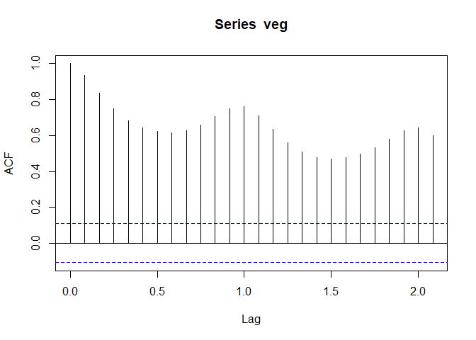
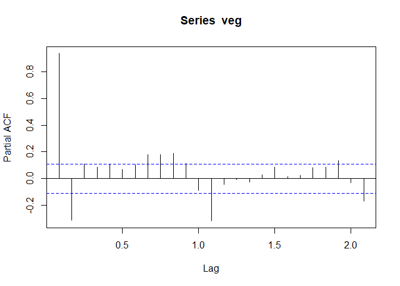
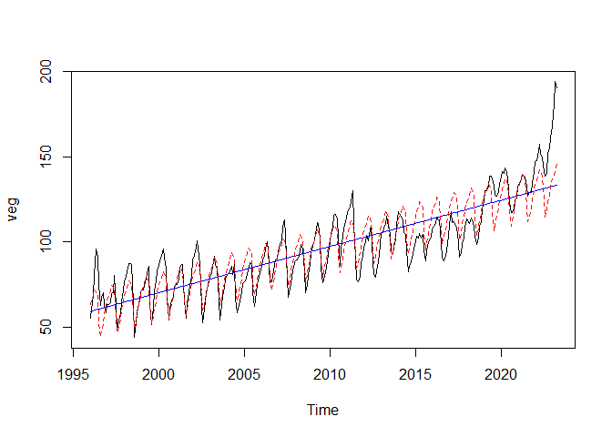
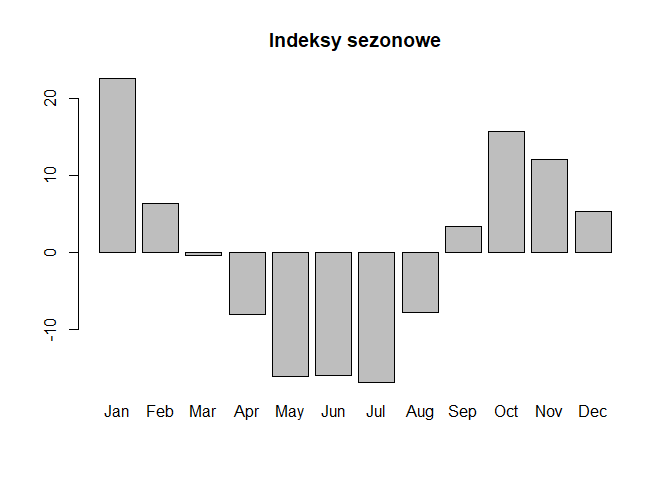
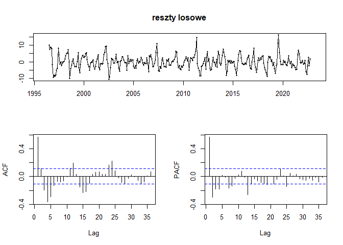

Projekt z SZEREGÓW CZASOWYCH
================
Martyna Pitera
2023-06-13

# Wprowadzenie

Celem projektu jest analiza dwóch szeregów czasowych.

Analizowane szeregi czasowe dotyczą wielkości populacji ludzi w wieku
powyżej 55 roku życia (włącznie) oraz cen warzyw w Polsce. Oba zbiory
danych pochodzą ze strony <https://fred.stlouisfed.org/>.  
(fred.stlouisfed.org - baza danych Rezerwy Federalnej)

Analiza pierwszego zagadnienia ma na celu obserwację zmian zachodzących
w społeczeństwie na całym świecie. Przewidywanie takich procesów jak
starzenie się (lub odmładzanie) społeczeństwa wpływa np. na decyzje
polityczne w sprawach polityki prorodzinnej czy prodemograficznej. Dane
dotyczące populacji pochodzą z okresu od stycznia 1948 do maja 2023.

Analiza cen warzyw w Polsce pozwoli zobrazować, jak na przestrzeni roku
zmieniają się ceny warzyw. W zależności od miesiąca, wahania cen są
mocno zauważalne; w trakcie zbiorów są najtańsze, a pożniej drożeją, co
można powiązać np. z kosztami magazynowania i przechowywania w
odpowiednich warunkach.

Indeks harmonizowany cen towarów i usług konsumpcyjnych (Harmonized
Index of Consumer Prices, HICP) jest miarą inflacji lub zmiany ogólnego
poziomu cen. Wskaźnik ten jest stosowany w Unii Europejskiej do
porównywania cen konsumpcyjnych między krajami członkowskimi.  
indeks 2015=100 oznacza, że wszystkie wartości indeksu są wyrażane jako
odchylenia od poziomu cen z 2015 roku. Na przykład, jeśli indeks wynosi
105, oznacza to, że ceny wzrosły o 5% w porównaniu do roku
referencyjnego.  
Ten dane dotyczą okresu od stycznia 1996 do czerwca 2023.

# Wczytanie danych

``` r
setwd('C:/Users/marty/Desktop/GITHUB/ts')
pop <- read.csv('pop.csv')
veg <- read.csv('veg.csv')

colnames(pop) <- c('data','liczba')
colnames(veg) <- c('data', 'cena')

pop$data <- as.Date(pop$data)
pop$liczba <- as.numeric(pop$liczba)

veg$data <- as.Date(veg$data)
veg$cena <- as.numeric(veg$cena)

pop <- ts(pop$liczba, start=1948, frequency = 12)
pop
```

    ##        Jan   Feb   Mar   Apr   May   Jun   Jul   Aug   Sep   Oct   Nov   Dec
    ## 1948 23311 23356 23407 23437 23492 23543 23650 23703 23761 23821 23876 23927
    ## 1949 23972 24016 24072 24117 24171 24220 24240 24297 24350 24418 24465 24527
    ## 1950 24568 24615 24668 24719 24756 24804 24860 24891 24947 25012 25060 25111
    ## 1951 25154 25195 25248 25281 25329 25375 25430 25486 25544 25600 25654 25708
    ## 1952 25746 25790 25840 25876 25926 25978 26034 26088 26146 26206 26260 26311
    ## 1953 26643 26691 26730 26760 26812 26866 26916 26972 27033 27093 27142 27197
    ## 1954 27247 27291 27336 27356 27401 27421 27441 27497 27549 27610 27671 27722
    ## 1955 27767 27807 27860 27899 27955 28008 28063 28115 28169 28224 28274 28329
    ## 1956 28366 28405 28458 28483 28554 28594 28583 28623 28682 28739 28790 28834
    ## 1957 28870 28913 28954 28998 29034 29093 29109 29160 29208 29263 29307 29341
    ## 1958 29366 29395 29438 29461 29499 29540 29579 29629 29688 29747 29796 29844
    ## 1959 29884 29920 29958 29997 30043 30083 30131 30185 30239 30288 30337 30389
    ## 1960 30509 30546 30596 30612 30648 30697 30750 30801 30858 30916 30983 31042
    ## 1961 31088 31124 31161 31220 31278 31324 31382 31441 31494 31555 31609 31658
    ## 1962 31703 31739 31787 32463 32500 32543 32605 32652 32709 32764 32812 32867
    ## 1963 32898 32930 32977 33000 33028 33071 33094 33121 33146 33205 33253 33301
    ## 1964 33342 33376 33414 33451 33511 33560 33610 33663 33718 33776 33828 33878
    ## 1965 33917 33958 34008 34041 34084 34132 34162 34210 34274 34332 34383 34434
    ## 1966 34473 34512 34559 34595 34650 34690 34732 34785 34835 34898 34955 35005
    ## 1967 35059 35095 35151 35199 35246 35299 35356 35414 35482 35548 35596 35651
    ## 1968 35692 35733 35766 35795 35852 35910 35977 36037 36093 36139 36198 36256
    ## 1969 36299 36307 36368 36421 36498 36547 36631 36684 36734 36809 36860 36912
    ## 1970 36945 37002 37055 37098 37157 37205 37277 37340 37406 37475 37539 37604
    ## 1971 37659 37704 37776 37838 37895 37948 38011 38070 38142 38214 38273 38340
    ## 1972 38750 38803 38845 38860 38915 38983 39046 39110 39176 39236 39299 39357
    ## 1973 39420 39459 39453 39502 39560 39618 39679 39744 39812 39885 39949 39971
    ## 1974 40088 40146 40209 40283 40353 40412 40478 40555 40639 40723 40802 40877
    ## 1975 40958 41033 41101 41164 41233 41319 41412 41494 41563 41638 41714 41800
    ## 1976 41882 41942 42021 42078 42137 42212 42291 42370 42453 42545 42623 42664
    ## 1977 42736 42806 42869 42938 43034 43120 43204 43278 43355 43433 43495 43576
    ## 1978 43652 43717 43774 43835 43910 43988 44070 44134 44219 44325 44397 44480
    ## 1979 44553 44614 44732 44751 44856 44930 45007 45085 45160 45266 45348 45428
    ## 1980 45507 45575 45650 45709 45763 45832 45913 45974 46036 46101 46161 46223
    ## 1981 46303 46342 46389 46440 46493 46565 46633 46691 46756 46831 46887 46943
    ## 1982 46991 47037 47102 47162 47223 47266 47324 47382 47440 47499 47552 47583
    ## 1983 47635 47674 47723 47761 47805 47860 47922 47969 48018 48076 48124 48182
    ## 1984 48244 48281 48320 48363 48400 48448 48499 48541 48604 48658 48707 48761
    ## 1985 48913 48951 48980 49002 49069 49086 49128 49200 49271 49317 49356 49369
    ## 1986 49293 49333 49393 49427 49468 49477 49524 49552 49617 49615 49666 49730
    ## 1987 49782 49809 49854 49846 49897 49922 49948 49991 50008 50038 50092 50128
    ## 1988 50165 50182 50187 50171 50179 50203 50241 50263 50305 50333 50381 50424
    ## 1989 50462 50440 50427 50467 50527 50570 50612 50619 50666 50706 50746 50762
    ## 1990 49816 49810 49797 49858 49860 49952 49997 50015 50064 50112 50126 50180
    ## 1991 50203 50226 50280 50265 50311 50334 50410 50447 50461 50506 50503 50557
    ## 1992 50618 50644 50679 50682 50715 50752 50781 50816 50859 50940 50950 50958
    ## 1993 51051 51082 51125 51131 51127 51161 51189 51271 51305 51332 51353 51370
    ## 1994 51463 51451 51497 51508 51522 51617 51689 51734 51758 51808 51858 51870
    ## 1995 51960 51957 51991 52055 52102 52145 52177 52247 52303 52345 52421 52491
    ## 1996 52597 52575 52602 52564 52651 52687 52750 52815 52854 52894 52927 52985
    ## 1997 53144 53231 53327 53290 53274 53366 53481 53614 53659 53775 53847 53923
    ## 1998 54077 54166 54316 54294 54267 54427 54629 54718 54806 54876 54897 54926
    ## 1999 55136 55226 55281 55421 55419 55482 55562 55609 55808 55862 55875 55891
    ## 2000 57151 57243 57345 57572 57588 57728 57747 57865 58010 58030 58006 58077
    ## 2001 58071 58198 58239 58281 58506 58634 58718 58824 58965 59156 59253 59348
    ## 2002 59422 59528 59651 59818 59942 60102 60205 60323 60437 60634 60792 60960
    ## 2003 61273 61367 61496 61601 61750 61903 62029 62190 62331 62499 62618 62719
    ## 2004 62782 62894 63002 63124 63283 63423 63580 63737 63902 64081 64200 64321
    ## 2005 64508 64650 64771 64898 65026 65136 65278 65444 65576 65726 65837 65949
    ## 2006 66213 66335 66492 66634 66775 66923 67043 67186 67347 67515 67628 67764
    ## 2007 67981 68077 68222 68353 68520 68682 68800 68964 69126 69320 69462 69628
    ## 2008 69878 69999 70125 70267 70393 70524 70659 70839 71012 71232 71379 71517
    ## 2009 71786 71910 72073 72244 72389 72555 72681 72875 73080 73290 73476 73662
    ## 2010 73726 73869 74019 74186 74304 74478 74620 74817 75019 75174 75351 75534
    ## 2011 75879 76009 76163 76296 76395 76558 76703 76916 77141 77321 77513 77693
    ## 2012 79181 79348 79520 79648 79819 80010 80183 80457 80713 80913 81123 81326
    ## 2013 81445 81614 81795 81937 82117 82287 82493 82709 82880 83116 83295 83517
    ## 2014 83691 83880 84087 84228 84431 84595 84788 84974 85181 85399 85604 85824
    ## 2015 86018 86235 86453 86642 86810 86970 87141 87330 87562 87809 88021 88237
    ## 2016 88366 88519 88671 88854 89032 89223 89399 89580 89799 90026 90216 90424
    ## 2017 90286 90447 90628 90829 90984 91124 91267 91457 91655 91865 92040 92204
    ## 2018 92477 92637 92769 92938 93109 93296 93458 93658 93834 94011 94188 94385
    ## 2019 94276 94400 94526 94665 94820 95003 95208 95444 95628 95789 95918 96070
    ## 2020 96046 96167 96295 96419 96522 96664 96827 97004 97205 97371 97487 97580
    ## 2021 97445 97545 97635 97736 97847 97975 98094 98280 98419 98529 98656 98741
    ## 2022 98159 98255 98399 98528 98646 98779 98908 99068 99190 99314 99457 99553
    ## 2023 99113 99113 99206 99305 99449

``` r
veg <- ts(veg$cena, start=1996, frequency = 12)
veg
```

    ##        Jan   Feb   Mar   Apr   May   Jun   Jul   Aug   Sep   Oct   Nov   Dec
    ## 1996  55.3  60.3  68.5  80.2  95.9  91.2  74.4  62.5  67.2  70.2  63.0  58.4
    ## 1997  63.0  63.2  64.3  69.5  70.2  80.1  62.4  48.1  54.1  58.0  64.8  71.1
    ## 1998  76.4  79.5  82.5  87.4  87.0  86.6  64.1  43.7  52.3  58.3  63.6  69.8
    ## 1999  71.5  71.5  73.9  78.2  82.1  85.7  63.2  51.4  61.4  70.9  77.3  82.8
    ## 2000  86.0  89.0  91.9  95.8  91.0  84.6  67.6  54.3  61.1  65.3  68.2  74.1
    ## 2001  74.9  75.0  78.0  84.7  86.5  86.9  65.5  55.3  63.5  69.9  74.4  79.7
    ## 2002  89.5  92.3  96.9 100.4  92.0  86.8  61.9  52.6  60.6  69.9  72.6  76.6
    ## 2003  79.3  81.2  85.6  91.6  86.3  84.7  65.6  54.1  63.3  68.1  73.5  78.2
    ## 2004  80.9  81.3  82.9  85.8  81.0  86.9  67.0  58.1  62.5  65.5  70.5  75.6
    ## 2005  76.3  77.3  80.7  83.0  88.0  87.0  70.2  61.9  66.1  74.6  77.6  81.4
    ## 2006  85.4  89.5  91.4  96.1 100.1  95.4  76.0  76.4  80.0  86.7  89.2  90.2
    ## 2007  95.0  98.4 101.4 108.7 112.8 104.4  78.5  67.6  72.9  75.4  82.9  87.9
    ## 2008  88.9  89.2  90.6  94.0  98.4  95.7  82.6  69.9  74.4  80.5  87.3  93.4
    ## 2009  97.8 101.2 104.4 111.5 110.8 102.5  84.0  75.8  77.7  82.0  88.2  93.2
    ## 2010  99.9 104.7 108.8 115.7 116.2 113.7 102.2  86.1  96.2 103.4 107.8 111.8
    ## 2011 117.4 118.4 120.3 123.9 130.2 110.4  90.7  77.8  76.5  79.5  87.0  91.4
    ## 2012  96.9  99.9 103.7 100.6 107.6 108.9  88.5  80.8  79.2  83.1  88.3  98.1
    ## 2013 105.4 105.4 108.0 110.5 115.2 109.1 104.8  93.8  92.9  96.7 101.1 110.2
    ## 2014 117.7 116.9 114.9 113.0 105.5 104.6  94.7  82.6  85.8  88.1  92.4  95.8
    ## 2015 100.9 103.2 102.4 104.7 102.0 104.4  94.5  88.9  94.9 100.2 100.8 103.0
    ## 2016 107.6 109.3 111.0 114.3 113.0 113.2  99.3  91.1  88.8  91.9  94.5 103.2
    ## 2017 110.4 117.6 111.3 111.8 109.1 108.9  99.5  91.0  92.9  99.0 102.0 108.7
    ## 2018 113.7 111.8 111.0 114.0 112.9 109.2 103.2  98.4 102.4 109.1 111.9 120.1
    ## 2019 123.8 130.2 130.3 133.0 138.7 138.6 137.1 133.2 127.2 127.1 129.6 134.3
    ## 2020 138.2 141.1 140.4 143.6 140.9 137.5 123.6 117.2 117.1 119.7 124.6 125.6
    ## 2021 132.5 134.3 136.4 139.7 138.9 137.9 132.7 126.7 129.0 129.8 134.5 140.9
    ## 2022 147.2 147.6 150.4 157.2 151.9 149.4 141.2 138.6 140.5 152.1 155.3 160.9
    ## 2023 168.1 180.8 194.1 190.6

``` r
is.ts(pop)
```

    ## [1] TRUE

``` r
is.ts(veg)
```

    ## [1] TRUE

# Omówienie głównych cech analizowanych szeregów na podstawie poznanych typów wykresów

## a. wykresy punktowe

``` r
options(scipen=5)
plot(pop)
```

<!-- -->

Na wykresie widać, że wielkość populacji ludzi w wieku powyżej 55 roku
życia (włącznie) niemalże ciągle rośnie. Obserwowalny jest m.in.
niewielki spadek pomiędzy 1980 i 2000 rokiem.

``` r
plot(veg)
```

<!-- -->

Wykres indeksu cen warzyw w Polsce charakteryzuje się trendem rosnącym
oraz wyraźną sezonowością. Ceny warzyw zmieniają się w każdym roku
zależnie od miesiąca; jest to przecież produkt sezonowy, nie produkowany
przez okrągły rok. Zbiory odbywają się w określonych porach roku i
właśnie wtedy warzywa są najtańsze.

## b. wykresy sezonowe

``` r
monthplot(pop)
```

<!-- -->

``` r
monthplot(veg)
```

<!-- -->

Powyższa funkcja pochodzi z pakietu stats i przedstawia podzbiory danych
dla każdego z okresów - dla miesięcznych szeregów, dla każdego miesiąca
rysowane są odrębne szeregi czasowe zawierające wartości zaobserwowane w
kolejnych latach. Ponadto wyznaczana jest średnia wartość zaznaczona
poziomą linią. Średnia utrzymuje się na prawie takim samym poziomie dla
każdego miesiąca.

Wykres monthplot dla szeregu czasowego dotyczącego populacji ukazuje
trend wzrostowy w każdym miesiącu. Z kolei wykres szeregu dla danych
dotyczących cen warzyw przedstawia zarówno sezonowość, jak i trend
wzrostowy. Średnia cen jest najwyższa w kwietniu.

``` r
library(forecast)

seasonplot(pop, 
           col = rainbow(75), 
           year.labels = TRUE, 
           pch = 19)
```

<!-- -->

``` r
seasonplot(veg, 
           col = rainbow(27), 
           year.labels = TRUE, 
           pch = 19)
```

<!-- -->

Funkcja seasonplot z pakietu forecast pozwala na zaprezentowanie danych
w rozbiciu na kolejne okresy jednostkowe. Forma taka pomaga analizować i
zauważać zarówno sezonowość okresów jak i odstępstwom od wzorca
sezonowości w poszczególnych okresach (np. jednostkowe, nietypowe
zachowanie w konkretnym roku).

Seasonal plot dla szeregu “pop” przedstawia kolorowe, wręcz symetryczne
względem siebie linie, czyli trend. Dla szeregu “veg” widać natomiast,
że ceny warzyw zazwyczaj są najniższe w sierpniu. Następnie zaczynają
powoli rosnąć, by zacząć się wyraźnie obniżać w okolicach czerwca.

## c. wykresy pudełkowe

``` r
boxplot(pop ~ cycle(pop))
```

<!-- -->

``` r
boxplot(veg ~ cycle(veg))
```

<!-- -->

Wykres typu boxplot dostarcza nam syntetycznych informacji na temat
zmienności szeregów dla poszczególnych okresów. Na wykresie mamy
mediany, kwartyle(brzegi pudełek), wartości minimalne i maksymalne(wąsy)
oraz wartości odstające (kropki)

Wykres pudełkowy potwierdza wniosek postawiony wcześniej, że w przypadku
szerego “pop” średnia z każdego miesiąca utrzymuje się na bardzo
zbliżonym poziomie.

Z kolei boxplot dla szeregu “veg” dowodzi, że średnia cena faktycznie
osiąga najniższą wartość w sierpniu. Choć najwyższy “wąs” dotyczy
stycznia, to jednak najwyższa średnia cen jest obserwowana w kwietniu.

## d. wykresy rozrzutu dla wartości opóźnionych

``` r
lag.plot(pop, lags=12, do.lines=FALSE)
```

<!-- -->

``` r
lag.plot(veg, lags=12, do.lines=FALSE)
```

<!-- -->

Wykres rozrzutu jest podstawowym narzędziem graficznym wykorzystywanym
do badania zależności dwóch zmiennych w klasycznej analizie danych. Na
wykresach rozrzutu dla wartości opóźnionych przedstawiamy zależność
wartości szeregu od wartości przesuniętych o opóźnienie lag - rysujemy
pary (X(t), X(t-lag)) dla kolejnych chwil t. Jeżeli punkty na wykresie
przedstawiają jednorodną chmurę punktów, bez jakiejkolwiek struktury,
świadczy to o braku istotnej zależności czasowej pomiędzy wartościami
szeregu przesuniętymi o konkretne opóźnienie.

Wykres rozrzutu dla pierwszego szeregu wskazuje na silną korelację
danych dla opóźnień każdym krokiem.

Dla szeregu veg zauważalna jest korelacja dla lag=1, oznacza to, że
obecne wartości szeregu czasowego są skorelowane z wartościami
opóźnionymi o jedną jednostkę czasu. To może wskazywać na autokorelację
autoregresyjną (AR) rzędu 1, co oznacza, że bieżące wartości są zależne
od wartości jednej poprzedniej obserwacji.

Mocna korelacja występuje też dla lag=12, co może wskazywać na obecność
rocznej sezonowości.

## e. wykresy autokorelacji ACF

``` r
acf(pop)
```

<!-- -->

Dodatnie i powoli zanikające wartości ACF sugerują, że dane zawierają
deterministyczną składową trendu.

``` r
acf(veg)
```

<!-- -->

ACF zanikające bardzo powoli i cyklicznie wskazuje na obecność trendu
sezonowego.

## f. wykresy cząstkowej korelacji PACF

``` r
pacf(pop)
```

<!-- -->

``` r
pacf(veg)
```

<!-- -->

# Dekompozycja

## a. dekompozycja addytywna szeregu z trendem

``` r
dpop <- decompose(pop, type = "additive")
plot(dpop)
```

<!-- -->

## b. dekompozycja multiplikatywna szeregu z trendem

``` r
dpop1 <- decompose(pop, type = "multiplicative")
plot(dpop1)
```

<!-- -->

Widać, że po dekompozycji multiplikatywnej wykres random jest mniej
wygładzony, ma większe wahania.

## c. dekompozycja addytywna szeregu z sezonowością

``` r
dveg <- decompose(veg, type = "additive")
plot(dveg)
```

<!-- -->

## d. dekompozycja multiplikatywna szeregu z sezonowością

``` r
dveg1 <- decompose(veg, type = "multiplicative")
plot(dveg1)
```

<!-- -->

Wykres random w przypadku dekompozycji addytywnej osiąga inny przedział
wartości - nawet wartości ujemne. Za to po dekompozycji multiplikatywnej
wykres znajduje się “wyżej” na osi Y.

## e. dekompozycja za pomocą ruchomej średniej szeregu z trendem

``` r
ts1ma1 <- filter(pop, sides=2, filter=rep(1/3,3))
ts1ma2 <- filter(pop, sides=2, filter=rep(1/7,7))
ts1ma3 <- filter(pop, sides=2, filter=rep(1/25,25))
plot(pop, col="black", lty=2)
lines(ts1ma1, col="red", lty=2)
lines(ts1ma2, col="blue", lty=2)
lines(ts1ma3, col="green", lty=2)
```

<!-- -->

Kolorowe linie leżą niemalże na oryginalnym wykresie szeregu czasowego
“pop” - od początku był on już dość gładki.

## f. dekompozycja za pomocą ruchomej średniej szeregu z sezonowością

``` r
ts1ma11 <- filter(veg, sides=2, filter=rep(1/11,11))
ts1ma22 <- filter(veg, sides=2, filter=rep(1/20,20))
ts1ma33 <- filter(veg, sides=2, filter=rep(1/25,25))

plot(veg, col="black", lty=2)
lines(ts1ma11, col="red", lty=2)
#lines(ts1ma22, col="blue", lty=2)
lines(ts1ma33, col="green", lty=2)
```

<!-- -->

Można zauważyć, że im większa wartość x w funkcji rep(1/x,x),
tymbardziej linie stają się wygładzone.

## g. dekompozycja wielomianowa szeregu z trendem

``` r
pop_poly1 <- tslm(pop~trend)
pop_poly2 <- tslm(pop ~ trend + season)

plot(pop)
lines(fitted(pop_poly1), col = "blue", lty = 1)
lines(fitted(pop_poly2), col = "red", lty = 2)
```

<!-- -->

Kolorowe linie nachodzą na siebie, ukazując wyraźny trend wzrostowy bez
trendu sezonowego.

## h. dekompozycja wielomianowa szeregu z sezonowością

``` r
veg_poly1 <- tslm(veg~trend)
veg_poly2 <- tslm(veg ~ trend + season)

plot(veg)
lines(fitted(veg_poly1), col = "blue", lty = 1)
lines(fitted(veg_poly2), col = "red", lty = 2)
```

<!-- -->

Niebieska linia na wykresie wskazuje na trend wzrostowy. Czerwona linia
świadczy zać o występowaniu sezonowości.

# Eliminacja trendu i sezonowości

## Na szeregach powstałych po dekompozycji addytywnej

``` r
dpop.trend <- dpop$trend
dpop.sezonowosc <- dpop$seasonal
dpop.indeksy <- dpop$figure
dpop.reszty <- dpop$random
barplot(dpop.indeksy, names.arg = month.abb, main="Indeksy sezonowe")
```

<!-- -->

``` r
tsdisplay(dpop.reszty, main="reszty losowe")
```

<!-- -->

``` r
dveg.trend <- dveg$trend
dveg.sezonowosc <- dveg$seasonal
dveg.indeksy <- dveg$figure
dveg.reszty <- dveg$random
barplot(dveg.indeksy, names.arg = month.abb, main="Indeksy sezonowe")
```

<!-- -->

``` r
tsdisplay(dveg.reszty, main="reszty losowe")
```

<!-- -->

## Odsezonowanie szeregu veg

``` r
dveg1 <- decompose(veg, type = "multiplicative")
dveg2 <- seasadj(dveg1)
plot(veg)
lines(dveg2, col="orange", lty=1)
```

<!-- -->

# Uczynienie szeregów stacjonarnymi

W tym celu przeprowadziłam różnicowanie na szeregach pierwotnych z
pomocą funkcji diff:

``` r
#Przed
tsdisplay(pop)
```

<!-- -->

``` r
#Po
popdiff <- diff(pop)
tsdisplay(popdiff)
```

<!-- -->

``` r
popdiff1 <- diff(popdiff, lag=12)  
tsdisplay(popdiff1)
```

<!-- -->

``` r
#Przed
tsdisplay(veg)
```

<!-- -->

``` r
#Po
vegdiff <- diff(veg)
tsdisplay(vegdiff)
```

<!-- -->

``` r
vegdiff1 <- diff(vegdiff, lag=12)
tsdisplay(vegdiff1)
```

<!-- -->

W celu sprawdzenia stacjonarności szeregu czasowego, przeprowadziłam
test Kwiatkowskiego-Phillipsa-Schmidta (KPSS).

Hipoteza zerowa (H0): Szereg czasowy jest stacjonarny.  
Hipoteza alternatywna (HA): Szereg czasowy nie jest stacjonarny.

``` r
library(tseries)
kpss.test(popdiff1)
```

    ## 
    ##  KPSS Test for Level Stationarity
    ## 
    ## data:  popdiff1
    ## KPSS Level = 0.045352, Truncation lag parameter = 6, p-value = 0.1

``` r
kpss.test(vegdiff1)
```

    ## 
    ##  KPSS Test for Level Stationarity
    ## 
    ## data:  vegdiff1
    ## KPSS Level = 0.050045, Truncation lag parameter = 5, p-value = 0.1

W obu przypadkach P-value dla testu KPSS wynosi 0.1, czyli jest większa
od poziomu istotności 0.05. To oznacza, że nie ma wystarczających
dowodów, aby odrzucić hipotezę zerową (H0) o stacjonarności poziomu
szeregu czasowego.

Na podstawie powyższych wyników można wnioskować, że nie ma istotnych
dowodów na niestacjonarność szeregów czasowych popdiff1 i vegdiff1.

# Sprawdzenie, czy szeregi są realizacją szumu białego

Symulacja szumu białego:

``` r
SB2 <- rnorm(n=50)
SB2 <- as.ts(SB2)
tsdisplay(SB2, main="Szum biały dla n=50")
```

<!-- -->

Szereg możemy uznać za realizację białego szumu jeżeli:  
i) co najmniej 95% autokorelacji próbkowych (ACF(h), h=1,2,.., hmax)
znajduje się w przedziale ufności  
ii) nie ma autokorelacji „istotnie ” wychodzących poza przedział
ufności  

``` r
tsdisplay(SB2)
```

<!-- -->

``` r
tsdisplay(popdiff1)
```

<!-- -->

Szereg popdiff1 (czyli pop po wyeliminowaniu trendu i sezonowości) nie
jest realizacją szumu białego ponieważ wartości korelacji wystają poza
przedziały ufności.

``` r
tsdisplay(SB2)
```

<!-- -->

``` r
tsdisplay(vegdiff1)
```

<!-- -->

Szereg vegdiff1 (czyli veg po wyeliminowaniu trendu i sezonowości) nie
jest realizacją szumu białego ponieważ wartości korelacji są dość duże i
wystają poza przedziały ufności.  

Dla szeregu popdiff1 warto brać pod uwagę modele AR(36), AR(24) i AR(12)
oraz MA(36), MA(24), MA(12).  

Dla szeregu vegdiff1 warto brać pod uwagę modele AR(36), AR(24) i AR(12)
oraz MA(35), MA(23), MA(12).  

# Metody estymacji

## Dopasowanie modelu AR dla szeregu popdiff1:

1.  Metoda Yule-Walkera

``` r
popdiff1.yw <- ar(popdiff1, aic=FALSE, order.max=36, method=c("yule-walker"))
popdiff1.yw
```

    ## 
    ## Call:
    ## ar(x = popdiff1, aic = FALSE, order.max = 36, method = c("yule-walker"))
    ## 
    ## Coefficients:
    ##       1        2        3        4        5        6        7        8  
    ##  0.0224   0.0110   0.0070   0.0226   0.0319   0.0005   0.0415   0.0009  
    ##       9       10       11       12       13       14       15       16  
    ## -0.0089   0.0022   0.0276  -0.6867   0.0380  -0.0114  -0.0184   0.0387  
    ##      17       18       19       20       21       22       23       24  
    ##  0.0362   0.0313   0.0714   0.0122   0.0078   0.0269   0.0166  -0.4719  
    ##      25       26       27       28       29       30       31       32  
    ##  0.0488   0.0090   0.0167   0.0244   0.0239   0.0279   0.0468  -0.0105  
    ##      33       34       35       36  
    ##  0.0197   0.0398   0.0374  -0.1731  
    ## 
    ## Order selected 36  sigma^2 estimated as  8280

2.  Metoda największej wiarygodności (MLE-Maksimum Likelihood
    Estimation)

``` r
popdiff1.mle <- ar(popdiff1, aic=FALSE, order.max=36, method=c("mle"))
popdiff1.mle
```

    ## 
    ## Call:
    ## ar(x = popdiff1, aic = FALSE, order.max = 36, method = c("mle"))
    ## 
    ## Coefficients:
    ##       1        2        3        4        5        6        7        8  
    ##  0.0223   0.0118   0.0075   0.0225   0.0324   0.0006   0.0415   0.0012  
    ##       9       10       11       12       13       14       15       16  
    ## -0.0081   0.0026   0.0261  -0.6833   0.0375  -0.0102  -0.0172   0.0378  
    ##      17       18       19       20       21       22       23       24  
    ##  0.0367   0.0307   0.0709   0.0111   0.0089   0.0295   0.0158  -0.4718  
    ##      25       26       27       28       29       30       31       32  
    ##  0.0461   0.0093   0.0165   0.0240   0.0240   0.0267   0.0462  -0.0114  
    ##      33       34       35       36  
    ##  0.0197   0.0413   0.0368  -0.1744  
    ## 
    ## Order selected 36  sigma^2 estimated as  7902

3.  Automatyczny dobór: (aic=TRUE)

``` r
popdiff1.aic <- ar(popdiff1, aic=TRUE)
popdiff1.aic
```

    ## 
    ## Call:
    ## ar(x = popdiff1, aic = TRUE)
    ## 
    ## Coefficients:
    ##       1        2        3        4        5        6        7        8  
    ##  0.0048   0.0034   0.0008   0.0201   0.0219  -0.0102   0.0251   0.0055  
    ##       9       10       11       12       13       14       15       16  
    ## -0.0142  -0.0118   0.0087  -0.6214   0.0108  -0.0195  -0.0294   0.0234  
    ##      17       18       19       20       21       22       23       24  
    ##  0.0163   0.0119   0.0395   0.0151   0.0003   0.0069  -0.0092  -0.3627  
    ## 
    ## Order selected 24  sigma^2 estimated as  8504

## Dopasowanie modelu AR dla szeregu vegdiff1:

1.  Metoda Yule-Walkera

``` r
vegdiff1.yw <- ar(vegdiff1, aic=FALSE, order.max=36, method=c("yule-walker"))
vegdiff1.yw
```

    ## 
    ## Call:
    ## ar(x = vegdiff1, aic = FALSE, order.max = 36, method = c("yule-walker"))
    ## 
    ## Coefficients:
    ##       1        2        3        4        5        6        7        8  
    ##  0.0739  -0.0035  -0.0257  -0.1361   0.0028  -0.0408   0.0194  -0.1072  
    ##       9       10       11       12       13       14       15       16  
    ## -0.0463  -0.0019  -0.0222  -0.5479   0.0355  -0.0811  -0.0002  -0.1468  
    ##      17       18       19       20       21       22       23       24  
    ## -0.0669  -0.0881  -0.0313   0.0015  -0.0629  -0.0696   0.0672  -0.2414  
    ##      25       26       27       28       29       30       31       32  
    ## -0.0351  -0.0224  -0.0011  -0.0760  -0.0271  -0.0911  -0.0230  -0.0018  
    ##      33       34       35       36  
    ## -0.1022   0.0083  -0.0498  -0.1463  
    ## 
    ## Order selected 36  sigma^2 estimated as  18.09

2.  Metoda największej wiarygodności (MLE-Maksimum Likelihood
    Estimation)

``` r
vegdiff1.mle <- ar(vegdiff1, aic=FALSE, order.max=36, method=c("mle"))
vegdiff1.mle
```

    ## 
    ## Call:
    ## ar(x = vegdiff1, aic = FALSE, order.max = 36, method = c("mle"))
    ## 
    ## Coefficients:
    ##       1        2        3        4        5        6        7        8  
    ##  0.0199  -0.0127  -0.0473  -0.1663  -0.0028  -0.0283  -0.0135  -0.1375  
    ##       9       10       11       12       13       14       15       16  
    ## -0.0588   0.0119  -0.0467  -0.7434  -0.0370  -0.1039  -0.0255  -0.2289  
    ##      17       18       19       20       21       22       23       24  
    ## -0.1481  -0.1027  -0.0428  -0.0124  -0.1023  -0.0863   0.0318  -0.4062  
    ##      25       26       27       28       29       30       31       32  
    ## -0.0918  -0.0474  -0.0376  -0.1256  -0.1003  -0.1256  -0.0416  -0.0115  
    ##      33       34       35       36  
    ## -0.1512  -0.0301  -0.0905  -0.2384  
    ## 
    ## Order selected 36  sigma^2 estimated as  13.26

3.  Automatyczny dobór: (aic=TRUE)

``` r
vegdiff1.aic <- ar(vegdiff1, aic=TRUE)
vegdiff1.aic
```

    ## 
    ## Call:
    ## ar(x = vegdiff1, aic = TRUE)
    ## 
    ## Coefficients:
    ##       1        2        3        4        5        6        7        8  
    ##  0.0512   0.0385  -0.0004  -0.0939   0.0365   0.0046   0.0316  -0.0860  
    ##       9       10       11       12  
    ## -0.0402   0.0334  -0.0437  -0.4493  
    ## 
    ## Order selected 12  sigma^2 estimated as  18.44

Automatyczny dobór jest zbliżony do metody Yule-Walkera. Automatyczny
dobór w obu przypadkach dobrał modele rzędu niższego niż ten dobrany
przed dwie pozostałe metody.

# Wyznaczenie współczynników dla modelu MA(q)

``` r
popdiff1_arima36 <- arima(popdiff1, order=c(0,0,36))
summary(popdiff1_arima36)
```

    ## 
    ## Call:
    ## arima(x = popdiff1, order = c(0, 0, 36))
    ## 
    ## Coefficients:
    ##          ma1     ma2     ma3     ma4     ma5      ma6     ma7     ma8     ma9
    ##       0.0399  0.0172  0.0309  0.0294  0.0208  -0.0052  0.0278  0.0107  0.0136
    ## s.e.  0.0343  0.0340  0.0343  0.0341  0.0346   0.0352  0.0345  0.0345  0.0344
    ##         ma10    ma11     ma12    ma13     ma14     ma15    ma16     ma17
    ##       0.0062  0.0408  -0.7834  0.0280  -0.0113  -0.0041  0.0122  -0.0131
    ## s.e.  0.0343  0.0344   0.0351  0.0423   0.0428   0.0425  0.0431   0.0419
    ##         ma18    ma19    ma20    ma21    ma22    ma23     ma24    ma25    ma26
    ##       0.0343  0.0141  0.0275  0.0433  0.0322  0.0006  -0.0778  0.0364  0.0426
    ## s.e.  0.0414  0.0428  0.0421  0.0430  0.0419  0.0441   0.0442  0.0345  0.0363
    ##         ma27    ma28     ma29     ma30     ma31    ma32    ma33    ma34    ma35
    ##       0.0847  0.0217  -0.0117  -0.0159  -0.0373  0.0057  0.0359  0.0023  0.0498
    ## s.e.  0.0342  0.0361   0.0337   0.0353   0.0346  0.0364  0.0349  0.0361  0.0352
    ##         ma36  intercept
    ##       0.0521     0.0561
    ## s.e.  0.0357     2.2945
    ## 
    ## sigma^2 estimated as 7322:  log likelihood = -5247.74,  aic = 10571.49
    ## 
    ## Training set error measures:
    ##                       ME     RMSE      MAE MPE MAPE      MASE         ACF1
    ## Training set -0.05009185 85.56642 29.83084 NaN  Inf 0.5546942 0.0003060691

``` r
popdiff1_arima24 <- arima(popdiff1, order=c(0,0,24))
summary(popdiff1_arima24)
```

    ## 
    ## Call:
    ## arima(x = popdiff1, order = c(0, 0, 24))
    ## 
    ## Coefficients:
    ##          ma1     ma2     ma3     ma4     ma5     ma6     ma7     ma8     ma9
    ##       0.0453  0.0340  0.0347  0.0275  0.0307  0.0032  0.0363  0.0158  0.0136
    ## s.e.  0.0347  0.0349  0.0355  0.0350  0.0353  0.0376  0.0370  0.0360  0.0362
    ##         ma10    ma11     ma12    ma13    ma14    ma15    ma16    ma17    ma18
    ##       0.0129  0.0392  -0.8204  0.0094  0.0184  0.0168  0.0225  0.0177  0.0523
    ## s.e.  0.0360  0.0362   0.0378  0.0329  0.0332  0.0335  0.0335  0.0337  0.0336
    ##         ma19    ma20    ma21    ma22    ma23     ma24  intercept
    ##       0.0268  0.0468  0.0485  0.0494  0.0215  -0.1218     0.2539
    ## s.e.  0.0354  0.0345  0.0345  0.0348  0.0351   0.0343     1.9640
    ## 
    ## sigma^2 estimated as 7271:  log likelihood = -5253.96,  aic = 10559.92
    ## 
    ## Training set error measures:
    ##                       ME     RMSE    MAE MPE MAPE      MASE          ACF1
    ## Training set -0.03210467 85.27253 27.952 NaN  Inf 0.5197577 -0.0006893394

``` r
popdiff1_arima12 <- arima(popdiff1, order=c(0,0,12))
summary(popdiff1_arima12)
```

    ## 
    ## Call:
    ## arima(x = popdiff1, order = c(0, 0, 12))
    ## 
    ## Coefficients:
    ##          ma1     ma2     ma3     ma4     ma5     ma6     ma7     ma8     ma9
    ##       0.0677  0.0205  0.0480  0.0247  0.0427  0.0105  0.0554  0.0144  0.0404
    ## s.e.  0.0235  0.0236  0.0236  0.0226  0.0242  0.0267  0.0243  0.0247  0.0246
    ##         ma10    ma11     ma12  intercept
    ##       0.0261  0.0543  -0.7874     0.3789
    ## s.e.  0.0232  0.0238   0.0267     1.8261
    ## 
    ## sigma^2 estimated as 7588:  log likelihood = -5257.93,  aic = 10543.86
    ## 
    ## Training set error measures:
    ##                       ME     RMSE     MAE MPE MAPE      MASE        ACF1
    ## Training set -0.02731722 87.10712 30.0807 NaN  Inf 0.5593403 -0.02139915

``` r
vegdiff1_arima35 <- arima(vegdiff1, order=c(0,0,35))
summary(vegdiff1_arima35)
```

    ## 
    ## Call:
    ## arima(x = vegdiff1, order = c(0, 0, 35))
    ## 
    ## Coefficients:
    ##          ma1      ma2      ma3      ma4      ma5      ma6     ma7      ma8
    ##       0.0639  -0.0318  -0.0895  -0.1858  -0.0377  -0.0011  0.0355  -0.1688
    ## s.e.  0.0652   0.0660   0.0642   0.0694   0.0680   0.0715  0.0697   0.0668
    ##           ma9     ma10     ma11     ma12     ma13     ma14    ma15    ma16
    ##       -0.0918  -0.0233  -0.0936  -0.7972  -0.1186  -0.1558  0.0025  0.1182
    ## s.e.   0.0621   0.0629   0.0691   0.0725   0.0843   0.0837  0.0823  0.0854
    ##          ma17    ma18     ma19    ma20    ma21    ma22    ma23    ma24    ma25
    ##       -0.1045  0.1053  -0.1506  0.4550  0.2067  0.0411  0.1598  0.0738  0.0415
    ## s.e.   0.0777  0.0872   0.0813  0.0877  0.0964  0.0892  0.0965  0.0688  0.0732
    ##         ma26     ma27    ma28    ma29    ma30    ma31     ma32     ma33
    ##       0.3007  -0.0947  0.1064  0.1620  0.0718  0.0688  -0.1912  -0.1466
    ## s.e.  0.0810   0.0747  0.0706  0.0716  0.0751  0.0722   0.0920   0.0925
    ##          ma34     ma35  intercept
    ##       -0.0100  -0.1975     0.0172
    ## s.e.   0.0904   0.0814     0.0620
    ## 
    ## sigma^2 estimated as 11.71:  log likelihood = -852.01,  aic = 1778.01
    ## 
    ## Training set error measures:
    ##                       ME     RMSE      MAE  MPE MAPE      MASE       ACF1
    ## Training set 0.009711629 3.421997 2.603942 -Inf  Inf 0.5713352 0.01058323

``` r
vegdiff1_arima23 <- arima(vegdiff1, order=c(0,0,23))
summary(vegdiff1_arima23)
```

    ## 
    ## Call:
    ## arima(x = vegdiff1, order = c(0, 0, 23))
    ## 
    ## Coefficients:
    ##          ma1     ma2      ma3      ma4      ma5      ma6      ma7      ma8
    ##       0.0600  0.0397  -0.0684  -0.1697  -0.0352  -0.0061  -0.0085  -0.1547
    ## s.e.  0.0636  0.0664   0.0723   0.0693   0.0680   0.0825   0.0725   0.0705
    ##           ma9     ma10     ma11     ma12     ma13     ma14    ma15    ma16
    ##       -0.1618  -0.0359  -0.0269  -0.8307  -0.1123  -0.0114  0.0395  0.1491
    ## s.e.   0.0784   0.0625   0.0719   0.0659   0.0637   0.0691  0.0694  0.0793
    ##          ma17    ma18    ma19    ma20    ma21     ma22    ma23  intercept
    ##       -0.0143  0.0494  0.0999  0.2791  0.0702  -0.0432  0.0845     0.0341
    ## s.e.   0.0852  0.0835  0.0902  0.0937  0.0880   0.0820  0.0917     0.0406
    ## 
    ## sigma^2 estimated as 12.9:  log likelihood = -863.29,  aic = 1776.57
    ## 
    ## Training set error measures:
    ##                       ME     RMSE      MAE MPE MAPE      MASE        ACF1
    ## Training set -0.01261049 3.592201 2.644111 NaN  Inf 0.5801488 0.003233248

``` r
vegdiff1_arima12 <- arima(vegdiff1, order=c(0,0,12))
summary(vegdiff1_arima12)
```

    ## 
    ## Call:
    ## arima(x = vegdiff1, order = c(0, 0, 12))
    ## 
    ## Coefficients:
    ##          ma1     ma2      ma3      ma4      ma5      ma6      ma7      ma8
    ##       0.0609  0.0051  -0.0231  -0.1117  -0.0719  -0.0327  -0.0057  -0.0341
    ## s.e.  0.0480  0.0474   0.0457   0.0435   0.0463   0.0534   0.0479   0.0499
    ##           ma9     ma10    ma11     ma12  intercept
    ##       -0.0474  -0.0564  0.0872  -0.7702     0.0303
    ## s.e.   0.0462   0.0427  0.0483   0.0577     0.0235
    ## 
    ## sigma^2 estimated as 14.18:  log likelihood = -872.55,  aic = 1773.1
    ## 
    ## Training set error measures:
    ##                      ME    RMSE      MAE  MPE MAPE      MASE       ACF1
    ## Training set -0.1270153 3.76517 2.724486 -Inf  Inf 0.5977839 0.03262558

# Wyznaczenie optymalnych modeli z wykorzystaniem funkcji auto.arima()

Dla szeregu popdiff1:

``` r
popdiff1_auto_arimaAIC <- auto.arima(popdiff1,ic="aic")
popdiff1_auto_arimaAIC
```

    ## Series: popdiff1 
    ## ARIMA(0,0,1)(0,0,1)[12] with zero mean 
    ## 
    ## Coefficients:
    ##          ma1     sma1
    ##       0.0564  -0.7216
    ## s.e.  0.0327   0.0256
    ## 
    ## sigma^2 = 7931:  log likelihood = -5273.52
    ## AIC=10553.04   AICc=10553.07   BIC=10567.42

``` r
popdiff1_auto_arimaAICC <- auto.arima(popdiff1,ic="aicc")
popdiff1_auto_arimaAICC
```

    ## Series: popdiff1 
    ## ARIMA(0,0,1)(0,0,1)[12] with zero mean 
    ## 
    ## Coefficients:
    ##          ma1     sma1
    ##       0.0564  -0.7216
    ## s.e.  0.0327   0.0256
    ## 
    ## sigma^2 = 7931:  log likelihood = -5273.52
    ## AIC=10553.04   AICc=10553.07   BIC=10567.42

``` r
popdiff1_auto_arimaBIC <- auto.arima(popdiff1,ic="bic")
popdiff1_auto_arimaBIC
```

    ## Series: popdiff1 
    ## ARIMA(0,0,0)(0,0,1)[12] with zero mean 
    ## 
    ## Coefficients:
    ##          sma1
    ##       -0.7131
    ## s.e.   0.0251
    ## 
    ## sigma^2 = 7951:  log likelihood = -5275.01
    ## AIC=10554.01   AICc=10554.03   BIC=10563.6

Najlepszym modelem jest ARIMA(0,0,1)(0,0,1) wyznaczona z identycznymi
współczynnikami przez dwa pierwsza kryteria dobroci dopasowania - aic i
aicc.

Dla szeregu vegdiff1:

``` r
vegdiff1_auto_arimaAIC <- auto.arima(vegdiff1,ic="aic")
vegdiff1_auto_arimaAIC
```

    ## Series: vegdiff1 
    ## ARIMA(2,0,2)(1,0,1)[12] with zero mean 
    ## 
    ## Coefficients:
    ##          ar1      ar2      ma1     ma2     sar1     sma1
    ##       1.0057  -0.9765  -0.9699  0.9468  -0.0663  -0.7585
    ## s.e.  0.0296   0.0348   0.0488  0.0522   0.0889   0.0699
    ## 
    ## sigma^2 = 15.01:  log likelihood = -876.08
    ## AIC=1766.16   AICc=1766.52   BIC=1792.43

``` r
vegdiff1_auto_arimaAICC <- auto.arima(vegdiff1,ic="aicc")
vegdiff1_auto_arimaAICC
```

    ## Series: vegdiff1 
    ## ARIMA(2,0,2)(1,0,1)[12] with zero mean 
    ## 
    ## Coefficients:
    ##          ar1      ar2      ma1     ma2     sar1     sma1
    ##       1.0057  -0.9765  -0.9699  0.9468  -0.0663  -0.7585
    ## s.e.  0.0296   0.0348   0.0488  0.0522   0.0889   0.0699
    ## 
    ## sigma^2 = 15.01:  log likelihood = -876.08
    ## AIC=1766.16   AICc=1766.52   BIC=1792.43

``` r
vegdiff1_auto_arimaBIC <- auto.arima(vegdiff1,ic="bic")
vegdiff1_auto_arimaBIC
```

    ## Series: vegdiff1 
    ## ARIMA(0,0,0)(1,0,1)[12] with zero mean 
    ## 
    ## Coefficients:
    ##          sar1     sma1
    ##       -0.0929  -0.6842
    ## s.e.   0.0909   0.0727
    ## 
    ## sigma^2 = 15.21:  log likelihood = -879.26
    ## AIC=1764.51   AICc=1764.59   BIC=1775.77

Najlepszym modelem jest ARIMA(2,0,2)(1,0,1) wyznaczona z identycznymi
współczynnikami przez dwa pierwsza kryteria dobroci dopasowania - aic i
aicc.

# Prognozowanie z wykorzystaniem metod naiwnych

Oba szeregi zostały obcięte tak, by obejmowały okres czasu do końca 2020
roku. Na tak obciętych szeregach przeprowadziłam prognozowanie na okres
od 2021 roku do ostatniego miesiąca, który obejmował szereg przed
obcięciem. Zestawiłam wykres prognozowany z tym, który już znamy.

``` r
popwyciete <- window(pop, start = c(1948,1), end = c(2020,12))

pop.meanf <- meanf(popwyciete, h = 29)
par(mfrow=c(2,1))
plot(pop, main="Oryginalny szereg")
plot(pop.meanf, main="Prognoza na podstawie średniej (szereg z trendem)")
```

<!-- -->

``` r
popdiff1wyciete <- window(popdiff1, start = c(1949,2), end = c(2020,12))

pop.meanf1 <- meanf(popdiff1wyciete, h = 29)
par(mfrow=c(2,1))
plot(popdiff1, main="Oryginalny szereg stacjonarny")
plot(pop.meanf1, main="Prognoza na podstawie średniej (szereg z trendem - stacjonarny)")
```

<!-- -->

``` r
pop.naive <- naive(popwyciete, h=29)
par(mfrow=c(2,1))
plot(pop, main="Oryginalny szereg")
plot(pop.naive, main="Metoda naiwna (szereg z trendem)")
```

<!-- -->

``` r
pop.snaive <- snaive(popwyciete, h=29)
par(mfrow=c(2,1))
plot(pop, main="Oryginalny szereg")
plot(pop.snaive, main="Metoda naiwna sezonowa")
```

<!-- -->

``` r
pop.dryft <- rwf(popwyciete, h=28, drift = TRUE)
par(mfrow=c(2,1))
plot(pop, main="Oryginalny szereg")
plot(pop.dryft, main="Metoda naiwna z dryftem")
```

<!-- -->

``` r
vegwyciete <- window(veg, start = c(1996,1), end = c(2020,12))

veg.meanf <- meanf(vegwyciete, h = 28)
par(mfrow=c(2,1))
plot(veg, main="Oryginalny szereg")
plot(veg.meanf, main="Prognoza na podstawie średniej (szereg z trendem i sezonowością)", ylim=c(40,200))
```

<!-- -->

``` r
vegdiff1wyciete <- window(vegdiff1, start = c(1997,2), end = c(2020,12))

veg.meanf1 <- meanf(vegdiff1wyciete, h = 28)
par(mfrow=c(2,1))
plot(vegdiff1wyciete, main="Oryginalny szereg stacjonarny")
plot(veg.meanf1, main="Prognoza na podstawie średniej (szereg z trendem i sezonowością - stacjonarny)")
```

<!-- -->

``` r
veg.naive <- naive(vegwyciete, h=28)
par(mfrow=c(2,1))
plot(veg, main="Oryginalny szereg")
plot(veg.naive, main="Metoda naiwna")
```

<!-- -->

``` r
veg.snaive <- snaive(vegwyciete, h=28)
par(mfrow=c(2,1))
plot(veg, main="Oryginalny szereg")
plot(veg.snaive, main="Metoda naiwna sezonowa",ylim=c(40,200))
```

<!-- -->

``` r
veg.dryft <- rwf(vegwyciete, h=28, drift = TRUE)
par(mfrow=c(2,1))
plot(veg, main="Oryginalny szereg")
plot(veg.dryft, main="Metoda naiwna z dryftem",ylim=c(40,200))
```

<!-- -->

# Prognozowanie z wykorzystaniem innych metod

``` r
hw.pop <- hw(popwyciete)
par(mfrow=c(2,1))
plot(pop, main="Oryginalny szereg")
plot(hw.pop, main="Prognozowanie za pomocą metody Holt-Wintersa")
```

<!-- -->

``` r
hw.veg <- hw(vegwyciete)
par(mfrow=c(2,1))
plot(veg, main="Oryginalny szereg")
plot(hw.veg, main="Prognozowanie za pomocą metody Holt-Wintersa")
```

<!-- -->

``` r
arima.pop <- forecast(popwyciete, h=29)
par(mfrow=c(2,1))
plot(pop, main="Oryginalny szereg")
plot(arima.pop, main="Prognozowanie za pomocą modelu ARIMA")
```

<!-- -->

``` r
arima.veg <- forecast(vegwyciete, h=28)
par(mfrow=c(2,1))
plot(veg, main="Oryginalny szereg")
plot(arima.veg, main="Prognozowanie za pomocą modelu ARIMA")
```

<!-- -->

## Ocena jakości przeprowadzonych prognoz

Za pomocą funkcji accuracy() z pakietu forecast obliczyłam miary jakości
prognoz.  
Im bardziej wartości zbliżone do 0, tym lepsza jest prognoza.  
W przypadku błędu średniokwadratowego (RMSE) i średniego błędu
bezwzględnego (MAE), niższe wartości wskazują na lepsze dopasowanie
prognoz. Można również uwzględnić błąd procentowy bezwzględny (MAPE),
gdzie niższe wartości wskazują na mniejsze procentowe odchylenie
prognoz.

``` r
accuracy(pop.meanf)
```

    ##                        ME     RMSE      MAE       MPE     MAPE     MASE
    ## Training set 3.467059e-13 19462.45 15320.43 -15.27211 34.63657 14.82063
    ##                   ACF1
    ## Training set 0.9955175

``` r
accuracy(pop.meanf1)
```

    ##                        ME     RMSE      MAE  MPE MAPE      MASE        ACF1
    ## Training set 2.924868e-16 110.4268 33.43246 -Inf  Inf 0.5677487 0.001068065

``` r
accuracy(pop.naive)
```

    ##                    ME     RMSE    MAE      MPE      MAPE       MASE      ACF1
    ## Training set 84.87886 128.3249 88.584 0.163368 0.1702062 0.08569411 0.3072776

``` r
accuracy(pop.snaive)
```

    ##                    ME     RMSE      MAE      MPE     MAPE MASE      ACF1
    ## Training set 1016.554 1231.746 1033.723 1.937321 1.971685    1 0.9869691

``` r
accuracy(pop.dryft)
```

    ##                         ME     RMSE      MAE         MPE      MAPE       MASE
    ## Training set -1.613305e-12 96.24379 54.23525 -0.03062093 0.1088063 0.05246592
    ##                   ACF1
    ## Training set 0.3072776

``` r
accuracy(hw.pop)
```

    ##                   ME     RMSE      MAE         MPE       MAPE       MASE
    ## Training set 2.24168 80.66612 26.56037 0.003828993 0.05276482 0.02569388
    ##                       ACF1
    ## Training set -0.0007912466

``` r
accuracy(arima.pop)
```

    ##                    ME     RMSE      MAE         MPE       MAPE       MASE
    ## Training set 2.505792 81.54922 26.83923 0.004337518 0.05207203 0.02596365
    ##                      ACF1
    ## Training set 0.0006091052

Na podstawie przedstawionych wyników wydaje się, że najlepsza prognoza
dla szeregu pop to ta z wykorzystaniem metody naiwnej z dryftem.

``` r
accuracy(veg.meanf)
```

    ##                        ME     RMSE      MAE       MPE     MAPE     MASE
    ## Training set 2.150317e-15 20.62089 16.79017 -5.504834 19.85297 1.956611
    ##                  ACF1
    ## Training set 0.926086

``` r
accuracy(veg.meanf1)
```

    ##                         ME     RMSE      MAE MPE MAPE      MASE       ACF1
    ## Training set -4.442207e-17 4.757295 3.437929 Inf  Inf 0.5781036 0.09869153

``` r
accuracy(veg.naive)
```

    ##                     ME     RMSE      MAE        MPE     MAPE      MASE
    ## Training set 0.2351171 7.402655 5.651171 -0.1856306 7.007487 0.6585486
    ##                   ACF1
    ## Training set 0.4198566

``` r
accuracy(veg.snaive)
```

    ##                    ME     RMSE     MAE     MPE     MAPE MASE      ACF1
    ## Training set 2.508333 10.68505 8.58125 1.96687 9.219082    1 0.8929986

``` r
accuracy(veg.dryft)
```

    ##                        ME    RMSE      MAE        MPE     MAPE      MASE
    ## Training set 3.897144e-15 7.39892 5.574027 -0.4564918 6.922158 0.6495589
    ##                   ACF1
    ## Training set 0.4198566

``` r
accuracy(hw.veg)
```

    ##                     ME     RMSE      MAE        MPE     MAPE      MASE
    ## Training set 0.1637781 4.018103 2.843141 0.02539571 3.312927 0.3313201
    ##                    ACF1
    ## Training set 0.09031392

``` r
accuracy(arima.veg)
```

    ##                    ME     RMSE      MAE        MPE     MAPE      MASE
    ## Training set 0.188679 3.997686 2.828672 0.06825739 3.291169 0.3296341
    ##                    ACF1
    ## Training set 0.09183656

Dla szeregu veg najlepsze wyniki dały metody naiwna z dryftem,
Holt-Wintersa oraz ARIMA.
